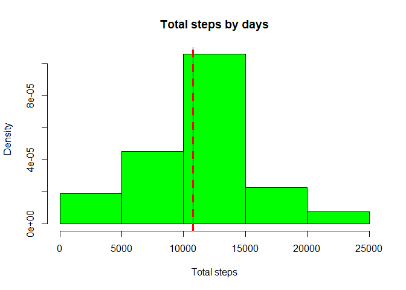
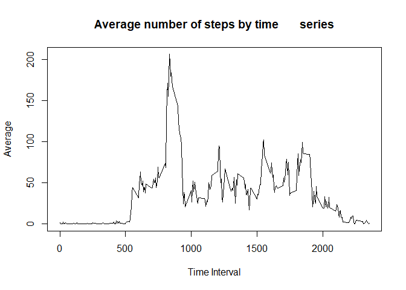
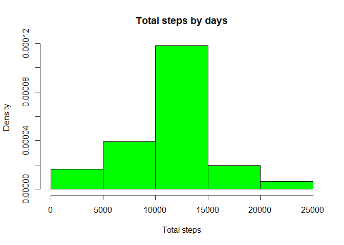
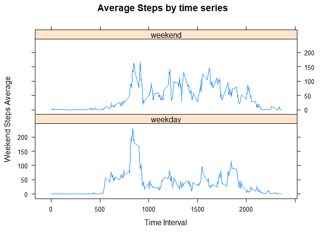

Reproducible Research Cource Project 1
--------------------------------------

Our goal is to consider the given data set, containing personal activity
monitoring device data. This device collects data at 5 minute intervals
through out the day. The data consists of two months of data from an
anonymous individual collected during the months of October and
November, 2012 and include the number of steps taken in 5 minute
intervals each day.

### Our project consists the next steps:

1.  Loading data

<!-- -->

     our_data_set <- read.csv("activity.csv")
     head(our_data_set)

    ##   steps       date interval
    ## 1    NA 2012-10-01        0
    ## 2    NA 2012-10-01        5
    ## 3    NA 2012-10-01       10
    ## 4    NA 2012-10-01       15
    ## 5    NA 2012-10-01       20
    ## 6    NA 2012-10-01       25

1.  Histogram of the total number of steps taken each days For this
    purpose we wil calculate the total number of steps by days

<!-- -->

     total_steps_by_days <- aggregate(our_data_set$steps ~ our_data_set$date, FUN=sum)

histogram with mean and median abline building

     hist(total_steps_by_days[,2], xlab = "Total steps", main = "Total steps by days", prob = TRUE, col = "green")
     abline(v=c(mean(total_steps_by_days[,2]),median(total_steps_by_days[,2])), col=c("blue", "red"), lty=c(1,2), lwd=c(1, 3))

like we see from our histogram, the median, and mean are very closed.

1.  Time series plot of the average number of steps taken

Average values by time series

     average_by_intervals <- aggregate(our_data_set$steps ~ our_data_set$interval, FUN=mean)

plot building

     plot(average_by_intervals[,1], average_by_intervals[,2], type = "l", xlab = "Time Interval", ylab = "Average", main = "Average number of steps by time       series", xlim = c(0, 2355))

1.  The 5-minute interval that, on average, contains the maximum number
    of steps

<!-- -->

     our_average_max <- max(average_by_intervals[,2])
     our_average_max

    ## [1] 206.1698

1.  Imputing missing data

First of all we calculate the total number of missing values

     sum_of_missing <- sum(is.na(our_data_set$steps))
     sum_of_missing

    ## [1] 2304

Strategy for imputimg missing data into new dataset. We will try the
mean value of time interval without loading additional pakages. We use
the for loop

     no_na_data_set <- our_data_set
     for(i in 1:nrow(our_data_set)){
        if(is.na(no_na_data_set[i,1])){
            no_na_data_set[i, 1] <- average_by_intervals[average_by_intervals[,1] == no_na_data_set[i,3],2] 
        }
     }
    head(no_na_data_set)

    ##       steps       date interval
    ## 1 1.7169811 2012-10-01        0
    ## 2 0.3396226 2012-10-01        5
    ## 3 0.1320755 2012-10-01       10
    ## 4 0.1509434 2012-10-01       15
    ## 5 0.0754717 2012-10-01       20
    ## 6 2.0943396 2012-10-01       25

1.  Histogram of the total number of steps taken each day after missing
    values are imputed

<!-- -->

     total_steps_no_na_values <- aggregate(no_na_data_set$steps ~ no_na_data_set$date, FUN=sum)
     hist(total_steps_no_na_values[,2], xlab = "Total steps", main = "Total steps by days", prob = TRUE, col = "green")

1.  Panel plot comparing the average number of steps taken per 5-minute
    interval across weekdays and weekends First of all we need to add a
    new column to dataset, which contains factor variable with two
    levels - "weekday" and "weekend"

<!-- -->

    library(dplyr)

    ## 
    ## Attaching package: 'dplyr'

    ## The following objects are masked from 'package:stats':
    ## 
    ##     filter, lag

    ## The following objects are masked from 'package:base':
    ## 
    ##     intersect, setdiff, setequal, union

    daysOfWeek_dataSet <- mutate(no_na_data_set, dayOfWeek = factor(case_when(
        weekdays(as.Date(date)) %in% c("Monday", "Tuesday", "Wednesday", "Thursday", "Friday") ~ "weekday",
        weekdays(as.Date(date))%in% c("Sunday", "Saturday")  ~ "weekend")))
    head(daysOfWeek_dataSet)

    ##       steps       date interval dayOfWeek
    ## 1 1.7169811 2012-10-01        0   weekday
    ## 2 0.3396226 2012-10-01        5   weekday
    ## 3 0.1320755 2012-10-01       10   weekday
    ## 4 0.1509434 2012-10-01       15   weekday
    ## 5 0.0754717 2012-10-01       20   weekday
    ## 6 2.0943396 2012-10-01       25   weekday

    library(lattice)
    weekAggr_subset <- aggregate(daysOfWeek_dataSet$steps, by=list(inteval = daysOfWeek_dataSet$interval, dayOfWeek = daysOfWeek_dataSet$dayOfWeek), mean)
    xyplot(weekAggr_subset[,3] ~ weekAggr_subset[,1] | factor(weekAggr_subset$dayOfWeek), layout = c(1,2), type = "l", xlab = "Time Interval", ylab = "Weekend Steps Average", main = "Average Steps by time series") 

